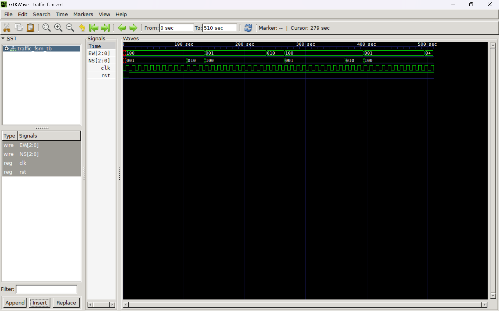

# Traffic Light FSM — V1 Basic

A self-contained Verilog implementation of a 4-state traffic light finite state machine (FSM) for a North-South / East-West intersection. All logic — state register, cycle counter, next-state logic, and output decode — lives in a single module.

---

## Files

| File | Description |
|------|-------------|
| `traffic_light_fsm.v` | Main FSM module (monolithic) |
| `traffic_light_tb.v`  | Testbench with clock, reset, monitor, and VCD dump |
| `traffic_fsm.vcd`     | Simulation waveform output |
| `waveform.png`        | GTKWave screenshot |

---

## FSM Design

### States

| State | Encoding | NS Signal | EW Signal |
|-------|----------|-----------|-----------|
| S0    | `2'b00`  | Green     | Red       |
| S1    | `2'b01`  | Yellow    | Red       |
| S2    | `2'b10`  | Red       | Green     |
| S3    | `2'b11`  | Red       | Yellow    |

Light signal encoding: `Green = 3'b001`, `Yellow = 3'b010`, `Red = 3'b100`

### State Transition Diagram

```
        count == 9                  count == 2
S0 ────────────────▶ S1 ────────────────────▶ S2
(NS Green)           (NS Yellow)               (EW Green)
  ▲                                               │
  │                                        count == 9
  │                                               ▼
  └──────────────────── S3 ◀────────────────────
        count == 2      (EW Yellow)
```

- **Green states (S0, S2):** hold for **10 clock cycles**
- **Yellow states (S1, S3):** hold for **3 clock cycles**
- One full cycle = **26 clock cycles**

### Reset

Reset is **active-low**. When `rst == 0`, the FSM returns to S0 and the counter clears to 0.

---

## Module Interface

```verilog
module traffic_fsm(
    input        clk,
    input        rst,           // active-low reset
    output reg [2:0] NS,        // North-South light
    output reg [2:0] EW         // East-West light
);
```

### Internal Signals

| Signal    | Width | Description                      |
|-----------|-------|----------------------------------|
| `present` | 2-bit | Current state register           |
| `next`    | 2-bit | Next state (combinational)       |
| `count`   | 4-bit | Cycle counter for state duration |

---

## Simulation

### Requirements

- [Icarus Verilog](http://iverilog.icarus.com/) — `iverilog`, `vvp`
- [GTKWave](http://gtkwave.sourceforge.net/) — waveform viewer

### Steps

```bash
iverilog traffic_light_fsm.v traffic_light_tb.v
vvp a.out
gtkwave traffic_fsm.vcd
```

### Testbench Behaviour

- Clock period: **10 time units** (`always #5 clk = ~clk`)
- Reset deasserted at `T=10` (`rst` goes 0 → 1)
- Simulation ends at `T=510`

---

## Simulation Output (excerpt)

```
Time=0   | rst=0 | state=xx | count= x | NS=xxx | EW=xxx  ← reset active
Time=10  | rst=1 | state=00 | count= 0 | NS=001 | EW=100  ← S0: NS Green
Time=105 | rst=1 | state=01 | count= 0 | NS=010 | EW=100  ← S1: NS Yellow
Time=135 | rst=1 | state=10 | count= 0 | NS=100 | EW=001  ← S2: EW Green
Time=235 | rst=1 | state=11 | count= 0 | NS=100 | EW=010  ← S3: EW Yellow
Time=265 | rst=1 | state=00 | count= 0 | NS=001 | EW=100  ← S0: cycle repeats
```

---

## Waveform



The waveform shows `NS[2:0]` and `EW[2:0]` cycling through the four states. The complementary nature of the two signals (one green while the other is red) is clearly visible across the full 510-unit simulation window.
