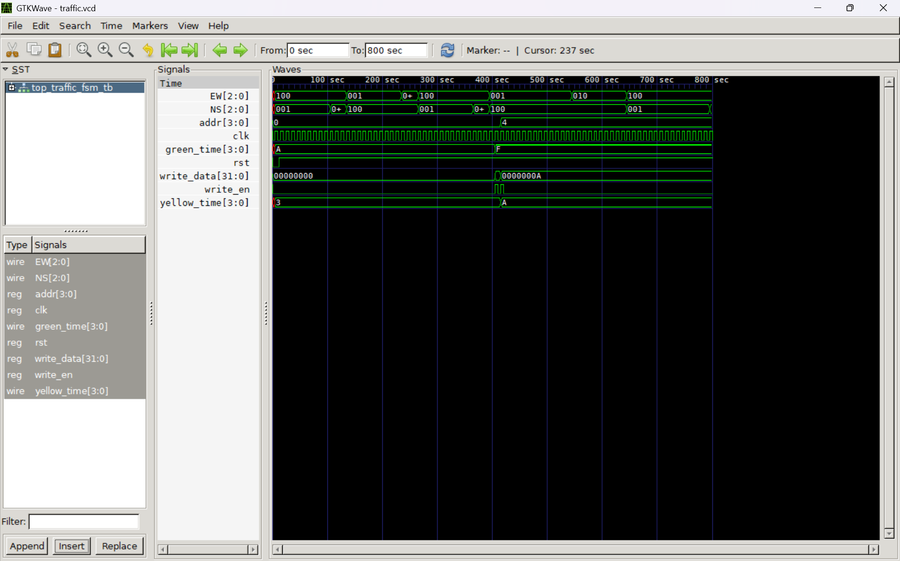

# Traffic Light FSM — V2 Modular with Registers

A modular, runtime-configurable Verilog implementation of a 4-state traffic light FSM for a North-South / East-West intersection. V2 refactors the monolithic V1 design into four dedicated sub-modules, and adds a **register-write interface** that allows green and yellow durations to be updated at runtime without re-synthesis.

---

## Files

| File | Module | Description |
|------|--------|-------------|
| `top_module.v` | `top_traffic_fsm` | Top-level integration — instantiates all sub-modules |
| `fsm_module.v` | `fsm` | Combinational next-state logic |
| `timer_module.v` | `timer` | Cycle counter parameterized by `green_time` / `yellow_time` |
| `output_module.v` | `output_module` | Moore output decoder (state → NS, EW) |
| `register_write_interface.v` | `reg_block` | Holds timing registers; supports runtime writes |
| `traffic_light_fsm_tb.v` | `top_traffic_fsm_tb` | Testbench including register-write demo |
| `traffic.vcd` | — | Simulation waveform output |
| `wavefrom.png` | — | GTKWave screenshot |

---

## Architecture

```
clk, rst ──────────────────────────────────────────────────▶┐
write_en ──────────────────────────────────────────────────▶│
addr[3:0] ─────────────────────────────────────────────────▶│  top_traffic_fsm
write_data[31:0] ──────────────────────────────────────────▶│
                                                             │
         ┌──────────────────────────────────────────────┐   │
         │               reg_block                      │   │
         │  green_time (default 10) │ yellow_time (def 3)│  │
         └────────────┬─────────────┴──────────────┬────┘   │
                      │                            │         │
         ┌────────────▼────────────────────────────▼────┐   │
         │                   timer                      │   │
         │          count[3:0] (cycle counter)          │   │
         └──────────────────────┬───────────────────────┘   │
                                │ count                      │
         ┌──────────────────────▼───────────────────────┐   │
         │                    fsm                       │   │
         │       (combinational next-state logic)       │   │
         └──────────────────────┬───────────────────────┘   │
                                │ next ──▶ present (top reg) │
         ┌──────────────────────▼───────────────────────┐   │
         │              output_module                   │   │
         │         present → NS[2:0], EW[2:0]          │   │──▶ NS, EW
         └──────────────────────────────────────────────┘   │
                                                             └┘
```

---

## FSM Design

### States

| State | Encoding | NS Signal | EW Signal |
|-------|----------|-----------|-----------|
| S0    | `2'b00`  | Green     | Red       |
| S1    | `2'b01`  | Yellow    | Red       |
| S2    | `2'b10`  | Red       | Green     |
| S3    | `2'b11`  | Red       | Yellow    |

Light signal encoding: `Green = 3'b001`, `Yellow = 3'b010`, `Red = 3'b100`

### State Transitions

```
        count == green_time-1            count == yellow_time-1
S0 ──────────────────────────▶ S1 ──────────────────────────▶ S2
(NS Green)                     (NS Yellow)                     (EW Green)
  ▲                                                               │
  │                                                    count == green_time-1
  │                                                               ▼
  └────────────────────────── S3 ◀──────────────────────────────
     count == yellow_time-1    (EW Yellow)
```

Reset is **active-low** — `rst == 0` forces state → S0 and count → 0.

---

## Sub-Module Reference

### `reg_block` — `register_write_interface.v`

Stores the two timing parameters. Values persist until overwritten.

```verilog
module reg_block(
    input        clk, rst,
    input        write_en,
    input  [3:0] addr,
    input [31:0] write_data,
    output reg [3:0] green_time,   // default: 10
    output reg [3:0] yellow_time   // default: 3
);
```

#### Register Map

| Address  | Register     | Reset Default |
|----------|--------------|---------------|
| `4'h0`   | `green_time` | 10 cycles     |
| `4'h4`   | `yellow_time`| 3 cycles      |

To write: assert `write_en = 1` for one clock cycle with the target `addr` and `write_data[3:0]`.                                                                       NOTE: addr uses direct values (0 and 4), not word indexing

---

### `timer` — `timer_module.v`

Counts up to `green_time - 1` during green states (S0, S2) and `yellow_time - 1` during yellow states (S1, S3), then wraps to 0.

```verilog
module timer(
    input        clk, rst,
    input  [3:0] green_time, yellow_time,
    input  [1:0] present,
    output reg [3:0] count
);
```

---

### `fsm` — `fsm_module.v`

Pure combinational logic. Computes `next` state based on `present`, `count`, `green_time`, and `yellow_time`.

```verilog
module fsm(
    input  [1:0] present,
    input  [3:0] green_time, yellow_time, count,
    output reg [1:0] next
);
```

---

### `output_module` — `output_module.v`

Decodes the current state into NS and EW light signals (Moore output).

```verilog
module output_module(
    input  [1:0] present,
    output reg [2:0] NS,
    output reg [2:0] EW
);
```

---

### `top_traffic_fsm` — `top_module.v`

Top-level wrapper. Holds the `present` state register and instantiates all four sub-modules.

```verilog
module top_traffic_fsm(
    input        clk, rst,
    input        write_en,
    input  [3:0] addr,
    input [31:0] write_data,
    output [2:0] NS,
    output [2:0] EW
);
```

---

## Simulation

### Requirements

- [Icarus Verilog](http://iverilog.icarus.com/) — `iverilog`, `vvp`
- [GTKWave](http://gtkwave.sourceforge.net/) — waveform viewer

### Steps

```bash
iverilog fsm_module.v output_module.v timer_module.v top_module.v traffic_light_fsm_tb.v register_write_interface.v
vvp a.out
gtkwave traffic.vcd
```

### Testbench Behaviour

- Clock period: **10 time units** (`always #5 clk = ~clk`)
- Reset deasserted at `T=12` (`rst` goes 0 → 1)
- At `T=405`: `green_time` written to **15** via `addr=0x0`
- At `T=415`: `yellow_time` written to **10** via `addr=0x4`
- Simulation ends at `T=800`

---

## Simulation Output (annotated)

**Phase 1 — Default timings (green=10, yellow=3):**
```
T=5   | state=00 | count= 0 | NS=001 | EW=100   ← S0: NS Green starts
T=105 | state=01 | count= 0 | NS=010 | EW=100   ← S1: NS Yellow
T=135 | state=10 | count= 0 | NS=100 | EW=001   ← S2: EW Green
T=235 | state=11 | count= 0 | NS=100 | EW=010   ← S3: EW Yellow
T=265 | state=00 | count= 0 | NS=001 | EW=100   ← S0: cycle repeats
```

**Register write — mid-simulation update:**
```
T=405 | we=1 | wdata=15 | addr=0 | G_Time=15 | Y_Time= 3   ← green_time → 15
T=415 | we=1 | wdata=10 | addr=4 | G_Time=15 | Y_Time=10   ← yellow_time → 10
```

**Phase 2 — Updated timings (green=15, yellow=10):**
```
T=495 | state=10 | count=10 | NS=100 | EW=001   ← EW Green now runs 15 cycles
T=545 | state=11 | count= 0 | NS=100 | EW=010   ← S3: EW Yellow now runs 10 cycles
T=645 | state=00 | count= 0 | NS=001 | EW=100   ← S0: NS Green now runs 15 cycles
```

---

## Waveform



The waveform clearly shows `green_time` jumping from `A` (10) to `F` (15) and `yellow_time` jumping from `3` to `A` (10) at around `T=400`, with the FSM state durations visibly extending in the second half of the simulation.
